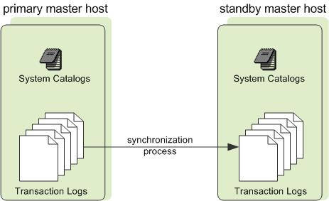
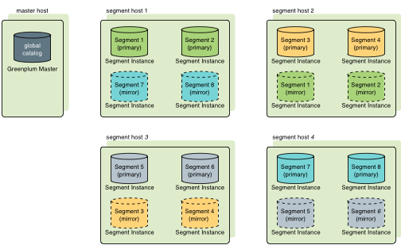
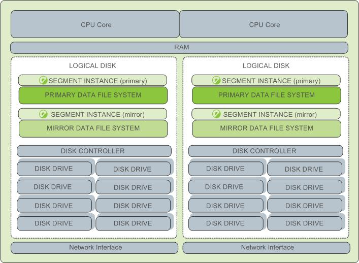
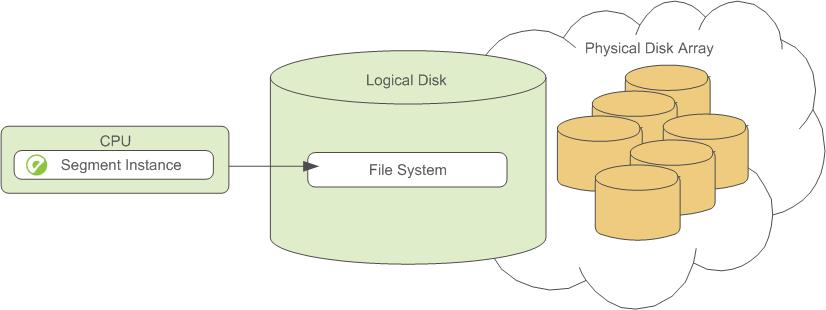
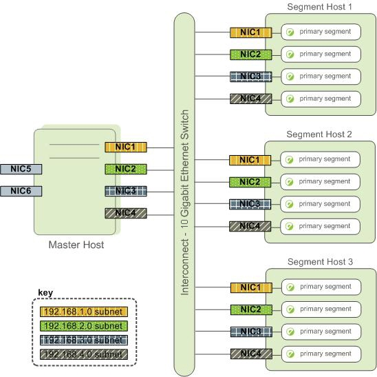
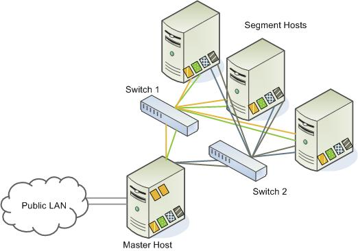
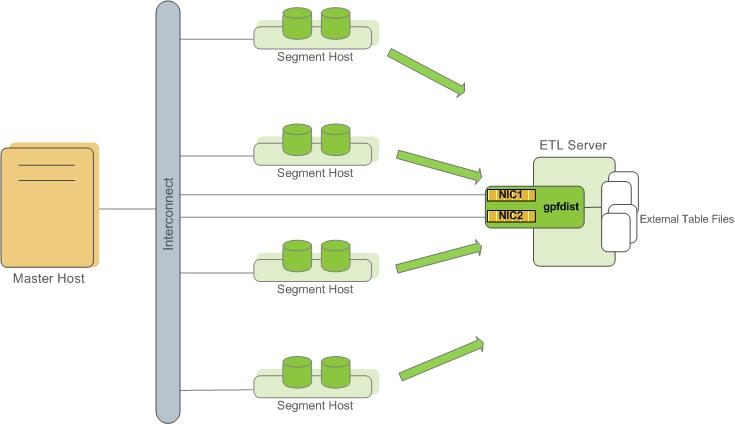
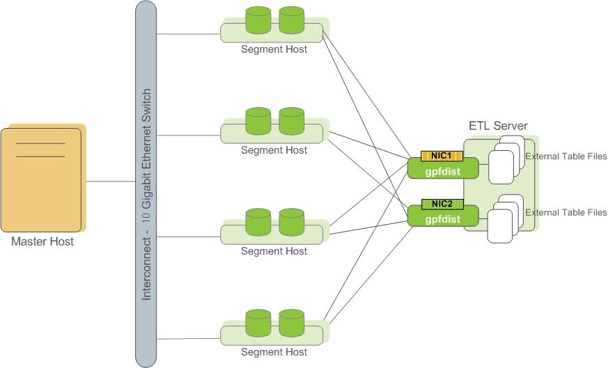
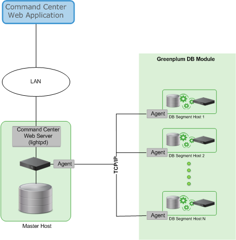

<!-- --- title: GPDB组件介绍-->

[[_TOC_|level = 3]]

# 0. Master

GPDB系统的入口

    1. 接收并认证客户端连接
    2. 处理用户提交的SQL语句
    3. 负责在segments间分发workload, 并收集每个segment的返回结果, 进行结果整合, 将结果返回给用户. 
    4. 用户可以使用PostgreSQL兼容客户端连接GPDB的master.
      

GPDB的元数据服务

    1. 维护`system catalog`.

        master上是不包含任何`用户数据`的, `用户数据`保存在`segment`服务器上.
        
硬件需求

    磁盘负载不高
    
    CPU的性能要高:
    
        1. 数据加载,比较耗费CPU资源
        2. 并发连接支持, 比较耗费CPU资源
        3. query plan,比较耗费CPU资源
        4. 如果用户在master上运行ETL工具或报表工具, 则需要更多的磁盘和CPU资源.

# 1. Master Redundancy (standby, mirror)

standby的作用

    master节点的热备节点, standby可以部署在单独的服务器上,或者某台segment的主机上.
    
standby的原理

    1. standby上, 运行事务日志复制进程(transaction log replication process), 
    确保master和standby之间的数据保持一致.
    
    2. 如果master失效, transaction log replication process会关闭, 管理员可以
       激活standby, 提升为master节点.
       
    3. 当standby节点被激活后, 利用复制的日志重新建立master状态, 达到最后一次成功提交时的状态.

> master和standby之间只同步`system catalog`数据, master上修改了`system catalog`中的数据,会自动同步到standby中.

# 2. segments

作用:

    1. 存储用户数据
    2. 处理查询过程

特点:

    1. 用户定义的`表`和`索引`是分布保存在多个segments上的.
    2. 每个segment只保存一部分用户数据
    3. segment实例是运行在segment主机上的数据库server进程
    4. 用户只能通过master与segmnet进行交互, 不能直接与segment进行交互

部署考量:

    1. 每个segment主机上的segment实例数,取决于:

        当前服务器的有效CPU核心数:
        
        例如: 
        
            2个双核处理器, 可以部署2个或4个segment实例
            3个四核处理器,可以部署3个, 6个或12个segment实例
            
# 3. Segment Redundancy (mirror)

部署segment mirror是可选的, 生产环境中推荐使用

作用:

    primary节点失效后, 数据库查询可以落到备份的segment上.
    
特点:

    1. mirror的segment一定与primary的segment不在同一台主机上.
    
mirror布局选项:

    1. group mirroring (默认配置)

        将某一台主机上的所有primary segments, 全部放在另外一台主机上
        
    2. spread mirroring

        前提要求: 集群中的segment主机数要大于primary的segment数目
        
        将某一台上的primary segment的mirror数据, 分散在除当前主机外的所有其他segment主机上.
        
        如果主机具有多网卡, 则primary和mirror的segments,应该均匀分布在2块网卡上.
        
group mirroring数据分布示意图

# 4. segment容灾处理

> 如果启用了segment的mirror功能, 如果primary segment失效, 系统会自动启用mirror segment.

    GPDB允许1个segment实例或segment主机失效, 而不影响GPDB集群正常运行.
    
    原理: 只要用户的所有数据在active的segment上是有效的, 整个集群就是可用的.
    
segment失效判断:

    master如果连接不上segment, 就在system catalog中标记该segment为invalid状态.
    
segment恢复:

    管理员介入, 将segment重新上线.管理员需要做下面的事情:
    
        将segment停机的变化复制到segment上.
        
> 如果gpdb没有启用mirror功能, 如果一个segment不可用, 整个GPDB将不可用, GPDB集群将自动关闭.

# 5. segment硬件配置实践

> segment主机的性能, 决定了GPDB的性能. 更精确一点, 最差的segment主机性能, 决定了整个GPDB的性能.

最佳实践: 

    1. 所有的segment使用相同的配置, 并且性能达到最优化状态.
    2. segment主机上, 不运行其他应用程序.确保主机资源和网络资源供segment专用.
    3. 主机上的有效CPU数目,决定了当前主机上的segment实例数目.

如下图所示: 
    
    这里每个CPU都只有一个primary segment.
    
    如果启用了mirror功能, 则每个CPU都1个primary segment + 1个mirror segment

# 6. segment磁盘配置实践

原则:

    1. 每个CPU对应于1个逻辑磁盘, 该逻辑磁盘可能包括:

        1. 保存primary segment数据的分区
        2. 1个保存primary segment数据分区 + 1个保存mirror segment的数据分区
        3. 逻辑磁盘最好是存存储池中划分出来的. 通过I/O channel或磁盘控制器进行访问.

逻辑磁盘布局示例:

# 7. Interconnect

> 推荐使用10 Gigabit Ethernet Switching fabric

特点:

    1. GPDB默认使用UDP进行通讯
    2. GPDB内部进行package的验证和检查工作, 因此可靠性等同于TCP传输, 但性能和扩展性比TCP要好.
    3. 参数gp_interconnect_type可以控制传输的协议选择.

# 8. Interconnect Redundancy

> 在master和segments之间, 部署双 10 Gigabit Ethernet switches

# 9. Network Interface Configuration

segment主机:

    一般会包含多块网卡, 供内部数据传输使用
    
master主机:

    除了包含一块内部网卡, 用于与segment通讯外,
    一般还会包括一块外部网卡, 与用户进行通讯
    
如何将网络负载,分担到不同的网卡上?

    1. 通过将不同的segment实例,绑定到不同的网卡上实现.
    2. 确保primary segment实例, 均匀的绑定到不同的网卡上.

    具体操作:
    
    为每块不同的网卡, 创建不同的`主机名`, 通过修改/etc/hosts实现解析过程.
    
    /etc/hosts包含的内容:
    
        1. 每个主机的主机名的解析
        2. 用于GPDB每个网卡的解析

网络接口架构示意图:

# 10. switch configuration

原则:

    如果存在多台交换机, 要将不同的`子网`均匀分布在不同的交换机上.
    
* NIC1, NIC2连接在switch1上, NIC3, NIC4连接在switch2上.  
* 假定master的hostname绑定到NIC1上, 因此连接到switch1上. 因此standby节点中的NIC1应该连接到switch2上.

    

# 11. ETL Hosts for Data Loading

> 主要是加载外部表, 通过gpfdist工具实现.

特点:
    
    1. 支持快速, 并行从外部表加载数据
    2. 可以创建专用的ETL服务器, 只运行gpfdist工具, 实现数据加载功能.
    3. gpfdist可以确保同时向所有的segment上传数据, 并行化程度高.

性能指标:

    1. delimited text formatted files: 350MB/s
    2. CSV格式: 200MB/s

使用gpfdist考虑:

    1. 如果是多网卡, 可以在每个网卡接口上,启用一个gpfdist进程.

        定义外部表的时候(CREATE EXTERNAL TABLE), 注意LOCATION从句
        
多网卡使用单一gpfdist实例:

多网卡使用多个gpfdist实例:

# 12. GPDB性能监控

> GPDB包含了1个专用的监控和管理数据库: gpperfmon (管理员可以安装和启用gpperfmon功能)

原理:

    1. 在每台segment上, 运行data collection agent
    2. agent定期收集查询状态和系统性能指标
    3. 每隔15秒, master节点会向segment的agent请求数据, 更行gpperfmon数据库.
    4. 用户可以查询gpperfmon数据库, 查看保存的查询状态和系统性能指标.

GPCC:

    基于WEB UI的GPDB性能监控和管理工具, 也是从gpperfmon数据库中读取数据的.
    
GPDB的监控架构:

