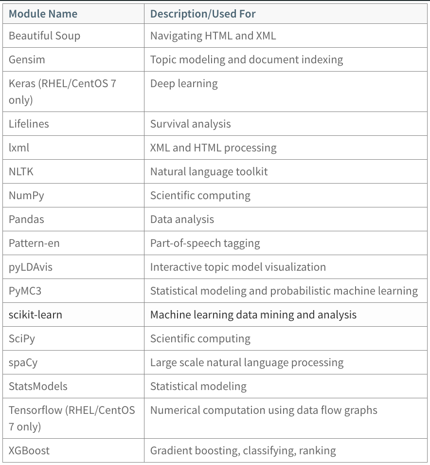
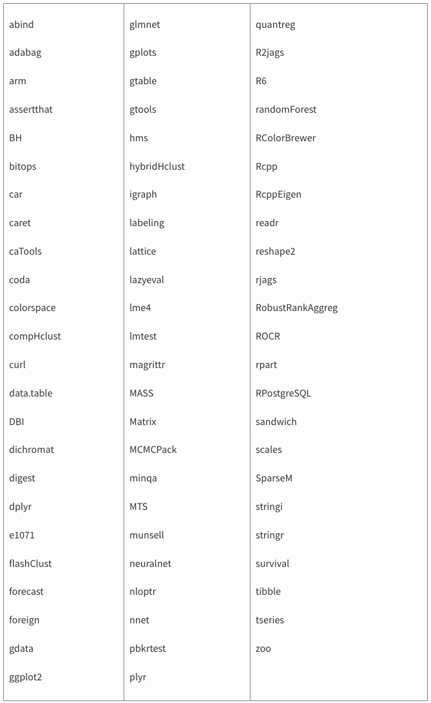

<!-- --- title: GPDB安装数据科学包-->

[[_TOC_|level = 3]]

# 0. 下载位置

[PIVNET](https://network.pivotal.io/products/pivotal-gpdb)

# 1. Python数据科学包

包括的内容:



前提条件: GPDB已经安装好,并且成功启动

安装:

```bash
# 确保$GPHOME和$MASTER_DATA_DIRECTORY
$ source /opt/greenplum/greenplum-db-4.3.16.1/greenplum_path.sh
$ source ~/.bashrc

# PyMC3需要tk, 所有机器上都要安装
$ yum install tk

# 在master上执行, 自动更新: PYTHONPATH, PATH, LD_LIBRARY_PATH
$ gppkg -i DataSciencePython-<version>-relhel<N>-x86_64.gppkg
$ source /usr/local/greenplum-db/greenplum_path.sh
$ gpstop -r
```

> Python数据科学包安装位置: $GPHOME/ext/DataSciencePython/lib/python2.7/site-packages/

卸载:

```bash
$ gppkg -q --all | grep DataSciencePython
DataSciencePython-<version>
$ gppkg -r DataSciencePython-<version>

$ source /usr/local/greenplum-db/greenplum_path.sh
$ gpstop -r 
```

# 2. R科学数据包

包括的内容:



安装:

```bash
# 确保$GPHOME和$MASTER_DATA_DIRECTORY
$ source /opt/greenplum/greenplum-db-4.3.16.1/greenplum_path.sh
$ source ~/.bashrc

# 在master上执行,自动更新R_LIBS_USER, PATH, LD_LIBRARY_PATH
$ gppkg -i DataScienceR-<version>-relhel<N>-x86_64.gppkg
$ source /usr/local/greenplum-db/greenplum_path.sh
$ gpstop -r
```

> R数据科学包安装位置: $GPHOME/ext/DataScienceR/library

注意:

默认: rjags库安装在: $GPHOME/ext/DataScienceR/extlib/lib

如果GPHOME不在:/usr/local/greenplum-db下, 需要执行:

```bash
$ gpssh -f all_hosts -e 'ln -s $GPHOME /usr/local/greenplum-db'
$ gpssh -f all_hosts -e 'chown -h gpadmin /usr/local/greenplum-db'
```

卸载:

```bash
$ gppkg -q --all | grep DataScienceR
DataScienceR-<version>
$ gppkg -r DataScienceR-<version>

$ source /usr/local/greenplum-db/greenplum_path.sh
$ gpstop -r 
```

启用:

```bash
$ source /usr/local/greenplum-db/greenplum_path.sh
$ createlang plr -d <DATABASE_NAME>
# 或者
$ psql -f $GPHOME/share/postgresql/extension/plr.sql -d <DATABASE_NAME>
```
