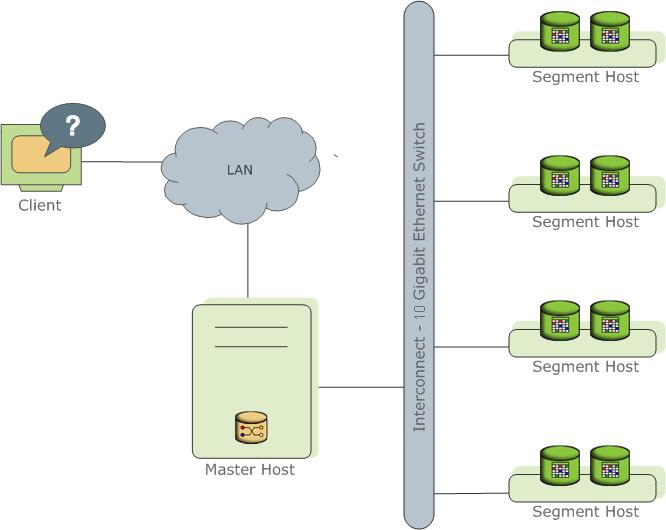
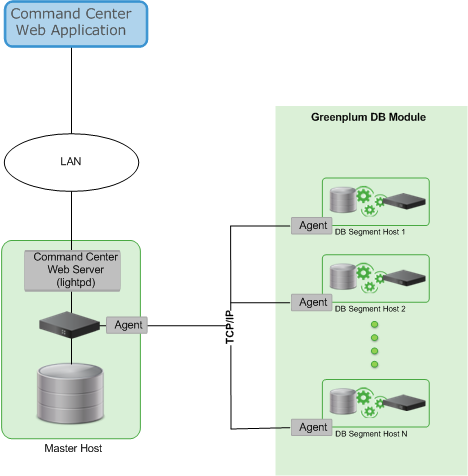

<!-- --- title: GPDB 概念-->

[[_TOC_|level = 3]]

# 0. GPDB架构

> GPDB是MPP(Massively Parallel processing)数据库, 适用于大数据分析和商业智能分析场景.

    MPP一般采用Shared nothing架构
    
    1. GPDB基于开源的PostgresSQL技术, 可以理解为是PG的并行化集群
    2. 目前 GPDB 5.1.0 基于pg 8.3.23版本
    3. GPDB使用append-optimiized(AO)存储技术,以支持批量加载数据和读取数据, 提升了HEAP表的性能.
    4. AO存储技术提供了数据保护的校验和检查, 面向行/列的压缩

GPDB与PG的不同:

    1. 支持GPORCA planner,同时也支持pg的legacy planner
    2. GPDB使用append-optimized存储(AO)
    3. GPDB支持面向列的存储, 面向列的存储只能用在AO表上.
    4. 列存储是支持压缩的.
    5. 几乎所有的压缩算法都可以应用在列/行的存储上, 除了Run-Length Encoded(RLE)算法,它只能应用在列存储上.
    6. GPDB支持列存储的AO表的压缩

GPDB修改了PG的哪些组件:

    这些修改都是为支持GPDB的并行化结构
    
    PG的内部组件:
    
    1. System catalog
    2. optimizer
    3. query executor
    4. transaction manager
    5. interconnect
    6. GPDB支持声明分区和子分区
    
    BI相关的组件:
    
    1. 并行化数据加载(外部表)
    2. 资源管理
    3. 查询优化
    4. 存储增强

GPDB的查询引擎:

    使用了Volcano-style查询引擎模型
    
    执行引擎利用执行plan, 生成了physical operators tree(POT), 通过POT评估table, 之后返回结果.
    
GPDB架构图:



# 1. master

角色: 

    GPDB的访问入口, 接收客户端连接和SQL查询, 将工作负载分发到segment实例上.

最终用户可以通过以下方式连接GPDB:

    psql, JDBC, ODBC, libpg
    
全局系统目录 (global system catalog):

    保存了GPDB的系统表, 这些系统表包含了GPDB的元数据.
    
Master的作用:

    1. 认证客户端连接
    2. 处理SQL命令
    3. 将工作负载分发到segment上
    4. 收集segment返回的结果, 进行聚合, 将结果返回给用户

预写日志 (Write-Ahead Logging, WAL):

    在启用了master/standby的GPDB集群中.
    
    WAL Logging: 所有的应用在生效之前, 都会先写入到日志中.确保了数据的完整性
    
    
NOTE:

    1. master不包含任何用户数据, 用户数据都保存在segment主机上.
    2. WAL logging`不会`应用在segment的mirror功能中

# 2. segments

> segment之间是独立的, 每个segment只会保存一部分用户数据; segments承载了大部分的查询负载.

查询过程:

    1. 用户连接master, 并提交SQL查询, 出发一个query
    2. master会在相关的segment实例上, 启动进程, 开始执行用户的查询.

用户数据:

    1. 用户定义表和用户定义的索引, 分布保存在整个segments主机中.
    2. 每个segment之后保留一部分用户数据
    3. 每个segment实例,会运行一个PG数据库进程
    4. 用户只能通过master与segment进行交互

NOTE:

    1. 运行segment实例的主机称为segment主机
    2. 一般情况, segment主机的数量在: 2 - 8个
    3. segment主机的硬件配置应该是完全一致的.(木桶原理)

# 3. Interconnect

> 推荐使用:10 Gigabit Ethernet switching fabric.

    1. 默认使用UDP传输, 支持流控, 数据包验证则是由GPDB内部控制, 好处:

        可靠性与TCP相当, 但是性能和可扩展性比TCP要好
        
    2. 如果将interconnect的类型改为TCP, 最多只支持1000个segments主机. 如果是UDP, 没有限制.

# 4. 管理和监控

> 相关工具主要在: $GPHOME/bin

可以完成的工作:

    1. 初始化GPDB Array
    2. 初始化GPDB系统
    3. 启动/停止GPDB
    4. 增加/删除主机
    5. 扩展Array,并且在新的segment上, 重新分布table数据
    6. 恢复失效的segment实例
    7. 管理失效和恢复master实例
    8. 并行化备份和恢复数据库
    9. 并行化加载数据
    10. 在GPDB数据库之间传输数据
    11. 系统状态报告

启用GPDB的监控系统:

**确保gpdb已经运行**

```bash
$ source $GPHOME/greenplum_path.sh
$ gpperfmon_install --enable --password <YOUR PASSWORD> --port 5432
$ gpstop -ra -M fast
```

    1. 在GPDB中创建了数据库:gpperfmon, 用于存放监控数据
    2. 在master和segments主机上, 安装了收集数据指标的agent, 这些agent会收集本机的性能指标
    3. master会每隔15秒, 从segment主机上收集一次性能数据, 保存到gpperfmon数据库中
    4. 用户可以通过查询gpperfmon数据库, 了解查询和系统指标.

启用GPCC:

```bash
$ gpcc_file=$(ls $optional_dir/greenplum-cc-web*.bin)
$ sudo echo -e "yes\n\nyes\nyes\n" | sudo MORE=-1000 /bin/bash $gpcc_file
$ sudo chown -R gpadmin:gpadmin /usr/local/greenplum-cc-web*
$ chmod -R 755 /usr/local/greenplum-cc-web*

$ echo "source /usr/local/greenplum-cc-web/gpcc_path.sh" >> /home/gpadmin/.bashrc
$ source /usr/local/greenplum-cc-web/gpcc_path.sh; echo -e "GPDB\n\n\n\n\n\n\nN\n" | gpcmdr --setup || [[ $? == 255 ]]
$ source /usr/local/greenplum-db/greenplum_path.sh; echo -e "y\n" | gpcmdr --start

$ open http://mdw:28080/
```

GPCC架构:



# 5. GPDB的并行控制

## 5.1 并发控制模型

> GPDB使用PG的多版本并发控制模型(Multiversion Concurrency Control, MVCC), 管理heap表的并发性事务.


    数据库管理系统的并发控制, 允许用户可以进行并发查询, 在保证数据库的完整性的前提下, 返回正确结果.
    
    传统数据库使用: 2阶段锁协议(two-phase locking)
    
        1. prevents a transaction from modifying data that has been read by another concurrent transaction

        2. prevents any concurrent transaction from reading or writing data that another transaction has updated

        问题: 降低了整个系统的事务处理吞吐量
        
    GPDB使用MVCC管理heap表的并发控制:
    
        1. 在MVCC下, 每个查询都会在一个数据库的快照上进行. (查询开始时的状态)
        2. 查询过程中, 当前查询时看不到其他事务对数据的修改的.

        优点: 可以确保用户在查询时刻, 数据状态的一致性.因此可以不存在锁的问题, 大大提高了系统的吞吐量.
        
    注意:
    
        Append-optimized表没有使用MVCC并发控制模型, AO表适用场景: 写一次, 读多次, 很少进行更新.

## 5.2 事务ID归零

> MVCC模型在开始查询或开始事务时, 会使用transaction IDs (XIDs), 以决定哪些行时可见的.

    XID是一个32位的值, 理论上一个数据库在该值发生溢出之前, 可以执行40亿次查询.
    
    实质上,在GPDB, 该事务ID = XIDs % (2^32), 当超过上限时, xmin必须替换为:FrozenXID, 这也就是VACUUM的功能之一.
    
        1. 每20亿次事务, 就应该Vacuum一次数据库, 避免事务ID出现归零.

> GPDB会监控事务ID, 如果超过设定报警值, 会发出报警.

```bash
WARNING: database "database_name" must be vacuumed within number_of_transactions transactions
```

    1. 当出现报警后, 需要进行VACUUM操作. 如果没有执行, GPDB会停止创建事务以避免可能的数据损失.

```bash
FATAL: database is not accepting commands to avoid wraparound data loss in database "database_name"
```

服务器配置参数:

    xid_warn_limit:
    
        告警阈值
    
    xid_stop_limit:
    
        错误阈值
        
## 5.3 事务隔离模型

并行提交事务的3种场景:

    脏读 (Dirty Read):

        当前事务可以读取其他事务未提交的数据
        
    不可重复读 (Non-repeatable read):
    
        在同一个事务中, 读取同一行的数据不一致, 原因:
        
            在当前事务开始后, 其他事务提交了新数据, 影响了当前事务再次读取相同记录行的结果.
            
    幻读 (Phantom read):
    
        在同一个事务中, 同一个查询执行2次, 返回2种不同的结果集, 原因:
        
            由于在进行事务的过程中, 其他事务添加了新的数据行.
            
标准SQL支持的4种事务隔离级别:

| 隔离级别         | 脏读   | 不可重复读 | 幻读   |
|:-----------------|:-------|:-----------|:-------|
| Read Uncommitted | 可能   | 可能       | 可能   |
| Read Committed   | 不可能 | 可能       | 可能   |
| Repeatable Read  | 不可能 | 不可能     | 可能   |
| Serializable     | 不可能 | 不可能     | 不可能 |

GPDB支持: Read Uncommitted, Read Committed, Serializable隔离级别.

    1. GPDB中的Read Uncommitted级别, 是按照Read Committed级别处理的.
    2. GPDB中强行指定:Repeatable Read级别, 会产生错误, 并且使用Serializable级别替代
    3. GPDB默认的隔离级别是: Serializable级别

READ COMMITTED和SERIALIZABLE的不同之处:

    1. 在READ COMMITTED级别中, 事务中每条语句,只可以看到那些在开始该语句之前, 已经被提交的数据行
    2. 在Serializable级别中, 事务中的所有语句,只可以看到那些在开始事务之前, 已经被提交的数据行
    3. READ COMMITTED隔离级别 相比于SERIALIZABLE级别, 其具有更好的并发性能.
    
MVCC快照隔离模型:

    1. 实现了Serializable隔离级别, 不会发生脏读, 不可重复读, 幻读的问题.
    2. 实现Serializable隔离级别的同时, 还没有`锁`的消耗 (事实上, GPDB中还是有其他锁存在)

使用隔离级别:

```sql
BEGIN TRANSACTION ISOLATION LEVEL SERIALIZABLE;
....
COMMIT;
```

```sql
BEGIN;
SET TRANSACTION ISOLATION LEVEL SERIALIZABLE;
...
COMMIT;
```

修改默认的隔离级别:

    1. GPDB默认的隔离: SERIALIZABLE
    2. 通过default_transaction_isolation属性设置

# 6. 移除表中的Dead Rows

    1. 更新或删除数据表中的记录时, 会导致遗留一下过期版本的行记录. 
    2. 当过期版本的行记录不再被活动事务引用时, 这些过期版本数据可以被删除
    3. VACUUM命令, 就是标记被这些过期版本记录占用的空间.

    如果表中存在大量的过期版本记录, 会导致磁盘占用量增长, 同时增加磁盘的I/O负担, 会造成数据库性能下降.
    这个过程称为: 膨胀(bloat), 
    
vaccumdb (无 --full, -f参数):

    1. 可以在执行其他查询时, 运行该命令, 不会锁表, 对性能不会有太大的影响
    2. 该命令标记之前的过期行数据为free状态
    3. 如果剩余的free空间很大, 该命令会将该page添加到数据表的free space map中,
       当GPDB为存储新行数据申请新的空间时, 会优先使用这些被标记为free的空间,
       如果没有空间, 才会考虑将新的page追加到文件中.
       
vacuumdb (--full, -f参数):

    1. 重写数据表 (不包括那些过期的数据行), 收缩数据表的大小到最小值
    2. 表中的每个page都被检查
    3. 可见行会"向上"移动到那些没有被写满的page中
    4. 丢弃空的page
    5. !!!!`重要:` 执行该命令时, 数据表会被锁定, 直到"vacuumed -f"完成!!!!!!!

> `vacuumdb -f`是非常重型的操作,要慎重使用, 最好在数据维护窗口期执行.

最佳实践:

    为避免使用"vacuumed -f", 可以使用"create table as"语句创建一张新表, 再drop掉旧表.
    
空闲空间映射: (free space map)

    1. 保存在共享内存(shared memory)中
    2. 跟踪所有表和索引的空闲空间
    3. 每个表或索引的空闲空间映射数据, 大约需要60字节的空间
    4. 每个page的空闲空间大约占6个字节.
    5. 相关配置参数:

        max_fsm_pages: 设置可以添加到共享空闲空间map中的最大的磁盘page数目.
        
            1. 默认值为: 200000
            2. 每个page槽(page slot), 大约消耗6个字节
            3. 该参数至少是: 16 * max_fsm_relations

        max_fsm_relations: 设置共享内存中的空闲空间map, 可以跟踪的最大relation数量
        
            1. 默认值: 1000
            2. 该参数必须大于: 总的table数量 + 总的indexes数量 + 总的system table数量
            3. 每个segment实例中的, 每个relation大约消耗60字节的内存.
            4. 该值设置的高点没关系, 但千万不能设置太低.

        NOTE:
        
            如果空闲空间map太小, 那一些磁盘page就不能加入到内存中的map数据中, 那这些磁盘page
            就不能直接重用, 只有执行vacuumed之后才能被重新使用, 这会导致数据文件增长很快.
            
    6. 查看某张table的vacuum报告:
        ```bash
        $ acuumdb -v -t t1
        INFO:  vacuuming "public.t1"  (seg2 192.168.0.10:40000 pid=5041)
        INFO:  vacuuming "public.t1"  (seg0 192.168.0.8:40000 pid=5044)
        INFO:  vacuuming "public.t1"  (seg1 192.168.0.9:40000 pid=5043)
        INFO:  index "t1_pkey" now contains 0 row versions in 1 pages  (seg1 192.168.0.9:40000 pid=5043)
        DETAIL:  0 index row versions were removed.
        0 index pages have been deleted, 0 are currently reusable.
        CPU 0.00s/0.00u sec elapsed 0.00 sec.
        INFO:  "t1": found 0 removable, 0 nonremovable row versions in 0 pages  (seg1 192.168.0.9:40000 pid=5043)
        DETAIL:  0 dead row versions cannot be removed yet.
        There were 0 unused item pointers.
        0 pages contain useful free space.
        0 pages are entirely empty.
        CPU 0.00s/0.00u sec elapsed 0.00 sec.
        INFO:  index "t1_pkey" now contains 0 row versions in 1 pages  (seg0 192.168.0.8:40000 pid=5044)
        DETAIL:  0 index row versions were removed.
        0 index pages have been deleted, 0 are currently reusable.
        CPU 0.00s/0.00u sec elapsed 0.00 sec.
        INFO:  "t1": found 0 removable, 0 nonremovable row versions in 0 pages  (seg0 192.168.0.8:40000 pid=5044)
        DETAIL:  0 dead row versions cannot be removed yet.
        There were 0 unused item pointers.
        0 pages contain useful free space.
        0 pages are entirely empty.
        CPU 0.00s/0.00u sec elapsed 0.00 sec.
        INFO:  index "t1_pkey" now contains 0 row versions in 1 pages  (seg2 192.168.0.10:40000 pid=5041)
        DETAIL:  0 index row versions were removed.
        0 index pages have been deleted, 0 are currently reusable.
        CPU 0.00s/0.00u sec elapsed 0.00 sec.
        INFO:  "t1": found 0 removable, 0 nonremovable row versions in 0 pages  (seg2 192.168.0.10:40000 pid=5041)
        DETAIL:  0 dead row versions cannot be removed yet.
        There were 0 unused item pointers.
        0 pages contain useful free space.
        0 pages are entirely empty.
        CPU 0.00s/0.00u sec elapsed 0.00 sec.
        ```
        
    7. 查看某张表在所有segments上使用的page情况:
        ```sql
        gpadmin=# SELECT relname, relpages, reltuples FROM pg_class WHERE relname='t1';
        relname | relpages | reltuples
        ---------+----------+-----------
        t1      |        1 |         0
        (1 row)
        ```
        
    8. 管理膨胀的工具:gp_toolkit.gp_bloat_diag;
        ```sql
        postgres=# \d gp_toolkit.gp_bloat_diag;
        View "gp_toolkit.gp_bloat_diag"
        Column    |  Type   | Modifiers
        -------------+---------+-----------
        bdirelid    | oid     |
        bdinspname  | name    |
        bdirelname  | name    |
        bdirelpages | integer |
        bdiexppages | numeric |
        bdidiag     | text    |
        View definition:
        SELECT bloatsummary.btdrelid AS bdirelid, bloatsummary.fnnspname AS bdinspname, bloatsummary.fnrelname AS bdirelname, bloatsummary.btdrelpages AS bdirelpages, bloatsummary.btdexppages AS bdiexppages, (bloatsummary.bd).bltdiag AS bdidiag
        FROM ( SELECT fn.fnoid, fn.fnnspname, fn.fnrelname, beg.btdrelid, beg.btdrelpages, beg.btdexppages, gp_toolkit.gp_bloat_diag(beg.btdrelpages, beg.btdexppages::integer, iao.iaotype) AS bd
            FROM gp_toolkit.gp_bloat_expected_pages beg, pg_class pgc, gp_toolkit.__gp_fullname fn, gp_toolkit.__gp_is_append_only iao
            WHERE beg.btdrelid = pgc.oid AND pgc.oid = fn.fnoid AND iao.iaooid = pgc.oid) bloatsummary
            WHERE (bloatsummary.bd).bltidx > 0;
            
        postgres=# select * from gp_toolkit.gp_bloat_diag where bdirelname = 't1';
        bdirelid | bdinspname | bdirelname | bdirelpages | bdiexppages | bdidiag
        ----------+------------+------------+-------------+-------------+---------
        (0 rows)
        ```

    
