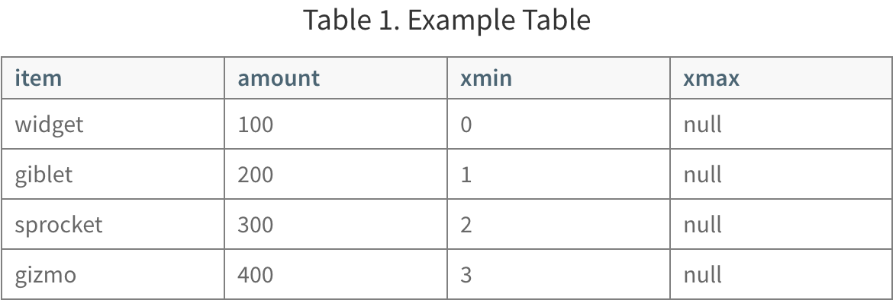

<!-- --- title: GPDB事务ID-->

[[_TOC_|level = 3]]

# 0. 介绍

事务ID (Transaction ID, XID):

    1. 类型为: 自增整数值, 32位, 最大值: 2^32 = 4,294,967,295, 大约40亿
    2. XID自增超过最大值, 会重置为0

GPDB处理XID的方式:

    1. row_id mod (2^32): 

        1. 这样GPDB就可以循环使用XID的值了.
        2. 取余操作,决定是事务的顺序, 后面的事务的XID > 前面事务的XID
        3. 每个XID值可以多达20亿的XID值被认为是之前的事务, 并且有20亿XID值被认为是新事务
        4. 只要2个事务的XID的支持在2^31之间, 比较结果就是正确的.

    2. Frozen XID:

        1. 用在当前可见数据上的XID., 作用:

            1. 任何XID与Frozen XID相比较, Frozen XID都是小的.
            2. 当Row的XID设置为Frozen XID, 会使用原先的XID, 没有重复的XID

    GPDB中涉及到分配XID的值的操作: 涉及到DDL, DML的事务性操作.
    
# 1. MVCC实例

## 1.1 实验环境描述:

    1. 数据表: 2列4行数据
    2. 合法的XID为: 0 ~ 9, 超过9, 就从0重新开始
    3. Frozen XID为: -2 (GPDB可不是这个值)
    4. 在单行上执行事务操作
    5. 仅仅涉及到插入,更新操作
    6. 所有已更新的数据都会保存在磁盘中, 没有移除Dead Row的操作.

## 1.2 管理同步事务



NOTE:

    这个表中多了2个字段, xmin和xmax字段:
    
    xmin: 当前行已经创建过的事务ID
    xmax: 当前行已经更行过的事务ID
    
在并行事务中做一些更新操作:

```
xid = 4: update tbl set amount=208 where item = 'widget'
xid = 5: update tbl set amount=133 where item = 'sprocket'
xid = 6: update tbl set amount=16 where item = 'widget
```

表中的数据如下:


    1. 表中加粗的行, 就是表的当前行, 其他行为过时的行
    2. xmax=null的所有行, 就是数据表的当前行

说明:
    
    假如以下2个事务是独立,且并行进行的:
    
        1. 使用Update语句, 更新sprocket的amount的值为: 133 (xmin的值为:5)
        2. 使用Select语句, 返回sprocket的所有值

    结论:
    
        在Update事务进行中(还没有提交事务), 使用SELECT语句返回的sprocket的值为300,  

> MVCC就是使用XID来决定数据表的状态的.

## 1.3 管理XID和Frozen XID

实验前提假设

    1. 数据库即将耗尽可用的XID值

当GPDB即将耗尽XID资源时, 会触发一些报警信息:

    WARNING: database "database_name" must be vacuumed within number_of_transactions transactions
    
在最后一个XID分配之前, GPDB会停止接收事务提交

    FATAL: database is not accepting commands to avoid wraparound data loss in database "database_name" 
    
vacuumdb命令

    1. 通过将xmin的值设置为Frozen XID, 释放XID值
    2. 管理数据表中的已过时或已删除的行.

执行一次vacuumdb的操作后的数据表:


    1. 对于过时的记录(widget, sprocket), 该行标记为:obsolete
    2. 对于当前行(giblet, gizmo), 将xmin设置为Frozen XID (-2)
       因此, 这些数据行对所有的事务都是可见的.
    3. 执行完这次VACUUM操作后, 0,1,2,3 的XID又可以被重复利用了.
    4. 当更新一条xmin=-2的记录时, 一般会用当前的事务ID(XID)设置xmax的值.
       在所有事务对原来数据行的访问结束后, 会将该行标记为obsolete
    5. obsolete行可以从磁盘中删除: vacuumdb -f 注意:这是一项重型操作

## 1.4 XID的取模计算

下面的表示再进行几次更新事务操作后, XID进行了reset的情况. 注意: 没有VACUUM操作


