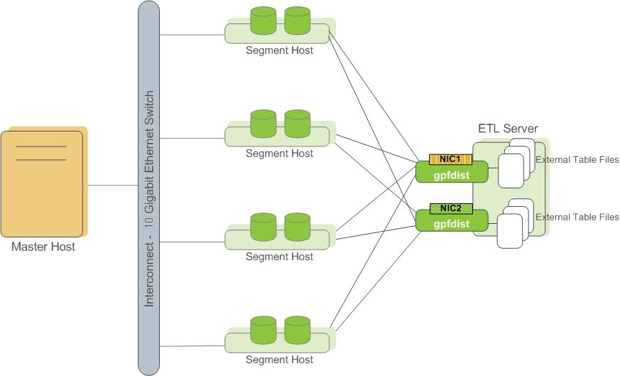

<!-- --- title: GPDB 并行数据加载-->

[[_TOC_|level = 3]]

# 0. 概述

解决的问题: 如何用最短的时间将TB级别的数据,加载都GPBD集群中

实现: 通过外部表功能实现

    1. 管理员在加载数据时, 可以以`单行错误`隔离模式,过滤错误的数据行, 加载到单独的table中, 
       正确的行会加载到目标表中.
    2. 管理员在加载数据时 ,可以指定容忍多少数据行出错.
    
使用模式:

    外部表 + gpfdist (Greenplum Database's parallel file server)
    
gpfdist架构:

另一个GPDB的数据加载工具: gpload, 通过YAML格式的配置文件,控制加载工作, 配置文件内容包括:

    1. 数据源位置
    2. 格式
    3. 必要的转换
    4. 分区hosts
    5. 目标数据库
    6. 其他
