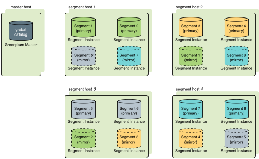
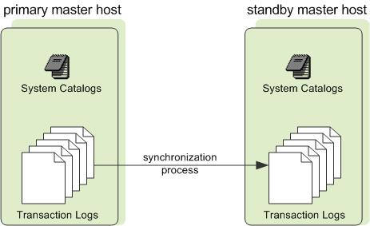

<!-- --- title: GPDB HA-->

[[_TOC_|level = 3]]

> 只有master和segment的mirroring功能都开启了, GPDB才是高可用的.

# 0. Segment Mirroring

> 生产环境中一定要启用Segment Mirroring

如果primary segment失效, GPDB会自动到secondary segment上查询数据.

    1. secondary segment一定会部署在不同于primary segment的主机上.
    
    2. 在虚拟化环境中, secondary segment的数据要与primary segment的数据保存在不同的存储上.

    3. 镜像分发算法包括: group mirroring (默认), spread mirroring

spread mirroring示意图:

# 1. Segmnet的失效恢复

> 自动恢复. 

    在启用了segment mirroring的GPDB集群中, 如果primary segment失效,
    查询会自动落到对应的mirror segment上.
    
> GPDB允许1个segment实例或主机失效, 而不影响整个集群的正常运行.

segment的失效判定:

    如果master不能连接到segment实例, 
    master会将该segment标记为失效状态, 并且启动mirror segment,期待其位置.
    
segment的恢复:

    必须管理员介入
    
发现失效的segment:

    gpstate
    
> 如果没有启用segment mirroring, 当一个segment实例失效时, 整个GPDB会自动关闭.

# 2. Master Mirroring (standby, mirroring)

作用:

    master主机的热备机
    
原理:

    1.在standby主机上运行着事务日志复制进程(transaction log replication process).
      负责同步master和standby主机之间的数据
    2.如果master主机宕机, log replication process会停止, standby可以被activated
      该切换过程, 不能自动完成, 必须外界触发. 一旦切换完成, standby会根据复制的日志, 
      重建master主机状态, 恢复到最后一次事务成功提交的时刻.standby主机成为GPDB新的master主机.
    3.master不保存任何用户数据, 仅仅保存system catalog table, 因此master和standby之间
      同步的也只是系统目录表.
      
Master Mirroring示意图:

# 3. 互联冗余

> 部署双千兆/万兆交换机

     
